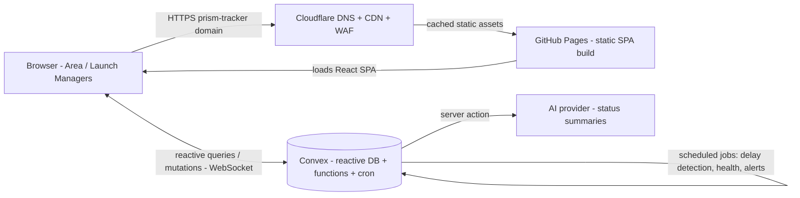

# Architecture — Prism Tracker

## 1. High-level topology



- **Cloudflare** sits in front: DNS, global CDN caching of the static bundle, TLS, WAF/rate-limiting, and a custom domain (e.g. `tracker.prism.internal` or a public subdomain restricted by auth).
- **GitHub Pages** serves the compiled Vite SPA (HTML/CSS/JS). It is purely static.
- **Convex** is the entire backend: reactive document database, query/mutation/action functions, authentication, and scheduled (cron) jobs. The SPA talks to Convex directly over a WebSocket for live updates.
- **AI provider** is called from Convex **actions** (server-side) so API keys never reach the browser.

---

## 2. Why this stack

| Concern | How it's met |
|---|---|
| Realtime UI (matches today's `onSnapshot` feel) | Convex reactive queries push updates automatically |
| No servers to run | Convex managed backend + static hosting |
| Automation (delay detection, health, alerts) | Convex scheduled functions (cron) |
| No Google Workspace dependency | Convex Auth with email/password or magic-link |
| Cheap internal hosting | GitHub Pages (free) + Cloudflare (free tier) |
| Secure secrets | AI keys live in Convex env, used only in actions |

---

## 3. Migration: Firebase → Convex

The current app uses Firebase Auth + Firestore. This is fully replaced.

| Today (Firebase) | Becomes (Convex) |
|---|---|
| `firebase.ts` (`initializeApp`, `getFirestore`, `getAuth`) | `convex/_generated` client + `ConvexProvider` |
| `firestore.rules` | Per-function auth checks + Convex validators (`v.*`) |
| `onSnapshot(query(...))` | `useQuery(api.module.fn, args)` |
| `addDoc / setDoc / updateDoc / deleteDoc` | `useMutation(api.module.fn)` |
| Firestore subcollections `projects/{id}/tasks` | Flat tables with indexed foreign keys (`storeId`, `initiativeId`) |
| `serverTimestamp()` | `Date.now()` set inside mutations |
| Google sign-in (`signInWithPopup`) | Convex Auth provider (password / magic-link) |
| `handleFirestoreError` | Convex throws typed errors; handled in UI |

### Code areas to change
- [src/firebase.ts](../src/firebase.ts) → delete; add `src/convex.ts` (client) and `convex/` (backend).
- [src/context/ProjectContext.tsx](../src/context/ProjectContext.tsx) → replace Firestore listeners/mutations with `useQuery`/`useMutation`. The provider shape (exposed hooks) can stay similar to minimize component churn.
- [src/firebase.ts](../src/firebase.ts) JSON config (`firebase-applet-config.json`) → removed; Convex uses `CONVEX_URL` env.
- Components ([Dashboard](../src/components/Dashboard.tsx), [TaskBoard](../src/components/TaskBoard.tsx), [SnagList](../src/components/SnagList.tsx), [ProjectList](../src/components/ProjectList.tsx), [TaskDetailModal](../src/components/TaskDetailModal.tsx)) → re-themed and re-pointed at the new domain model (stores/initiatives/rollouts) but keep their structure.

### Domain remap
The generic "Projects → Tasks → Snags → Comments" model is reshaped for retail rollouts:

| Old concept | New concept |
|---|---|
| Project | Initiative (trial/launch/pilot/transition) |
| Task | Rollout (a store's participation in an initiative) |
| Snag | Blocker / Delay reason |
| Comment | Update / note on a rollout |
| Team member | Area Manager / user |

Full schema in [DATA_MODEL.md](DATA_MODEL.md).

---

## 4. Frontend architecture

- **Build:** Vite (existing `vite.config.ts`). Add `base: '/<repo-name>/'` for GitHub Pages project sites (or `'/'` for a custom domain). See [DEPLOYMENT.md](DEPLOYMENT.md).
- **State:** Convex `useQuery`/`useMutation` are the data layer. A thin React context (`DataProvider`, evolved from `ProjectContext`) exposes typed hooks to components.
- **Routing:** lightweight client routing (hash or `BrowserRouter` with a `404.html` fallback for Pages deep links).
- **Styling:** Tailwind v4, Prism design tokens, **blue** accent — see [DESIGN_SYSTEM.md](DESIGN_SYSTEM.md).

---

## 5. Backend architecture (Convex)

```
convex/
  schema.ts          # tables: users, stores, initiatives, rollouts,
                     #         milestones, delayReasons, updates, alerts, imports
  auth.ts            # Convex Auth config
  stores.ts          # queries/mutations for stores
  initiatives.ts     # queries/mutations for initiatives
  rollouts.ts        # status changes, delay capture, health calc helpers
  imports.ts         # CSV/Excel ingest action + idempotent upsert mutation
  health.ts          # roll-up queries (region/initiative/portfolio)
  alerts.ts          # notification creation + read state
  ai.ts              # action: call AI provider for summaries (server-only key)
  crons.ts           # scheduled: delay detection, health refresh, digest alerts
```

- **Queries** are reactive and used for all reads (auto-updating UI).
- **Mutations** perform writes with validation and auth checks.
- **Actions** handle external calls (AI, email) and can call mutations.
- **Crons** run the automation: nightly delay sweep, health recompute, and alert digests.

---

## 6. Security

- **Auth:** every Convex function checks the authenticated identity (`ctx.auth.getUserIdentity()`); unauthenticated calls are rejected.
- **Roles:** `admin` / `editor` / `viewer` stored on the user record; mutations enforce role (e.g. only admin imports; only editor+ changes status).
- **Data scoping:** Area Managers can be restricted to their region's stores (optional rule).
- **Secrets:** AI/email keys in Convex environment variables, used only inside actions — never shipped to the browser.
- **Edge:** Cloudflare provides TLS, rate limiting, and optional access rules (e.g. country/IP allowlists, or Cloudflare Access for SSO-style gating).
- **Input validation:** Convex `v.*` validators on every function argument; enum fields constrained (status, type, health, delay category).
- The existing [security_spec.md](../security_spec.md) threat catalog is migrated into per-function checks and documented test cases.

---

## 7. Environments

| Env | Convex deployment | Hosting |
|---|---|---|
| **Dev** | `npx convex dev` (per-developer) | `npm run dev` (localhost:3000) |
| **Prod** | `npx convex deploy` (production) | GitHub Pages via GitHub Actions, fronted by Cloudflare |

Frontend reads `VITE_CONVEX_URL` at build time (injected per environment).
