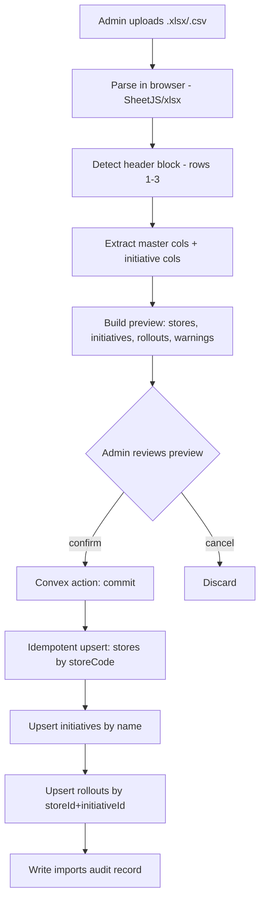

# Data Import — Prism Tracker

How the existing Excel/CSV "Ongoing Tracker" is parsed into Convex (`stores`, `initiatives`, `rollouts`). This is the single most important pipeline because the spreadsheet is the seed of all data.

Source file analyzed: `Ongoing Tracker'2026 - New Launches & Trials (Trials & Transitions).csv`

---

## 1. The spreadsheet is a matrix with a multi-row header

The file is **not** a clean table. The first **three rows** form a merged, multi-level header:

```
Row 1: Store Code | Store Name | Area Manager | Region | City | Store Format | Menu Type | Coffee machines Name | Type of Merrychef | Trials | (blanks) | Pilot - Pasta
Row 2:    (blank master cols)                                                                    | Milk spec | Masala Chai Powder | Dilicia Milk | Yoga Bar- Oat Milk | Napoli Margherita Pizza | Vanilla Frappe | (blank) | Aglio Olio / Alfredo / Creamy Tomato
Row 3: Store Code | ... | Type of Merrychef | Trial Start Date: | Trial Start: 9 Oct'25 | Trial Start: 5 Jan'26 | Start 5 Mar'26 / End 4 Apr'26 | Start 25-05-2026 / End 24-06-2026 | Nutaste BLR & Delhi/NCR 8 Jun–7 Jul'26 | Olam HYD & West 8 Jun–7 Jul'26 | Launch 11 Jun'26 Mum / End 10 Jul'26
Row 4+: actual store data rows (S001, S002, ...)
```

So:
- **Columns A–I (0–8)** = store master data (one record per row).
- **Columns J onward** = one **initiative** each; the cell value (`Yes` / blank) = participation.
- **Initiative metadata** (name, dates, region scope, vendor, variants) is spread across header rows 1–3 of that column.

---

## 2. Column → field mapping (master data)

| CSV column | Target | Table.field |
|---|---|---|
| Store Code | `S017` | `stores.storeCode` (natural key) |
| Store Name | `TWC-Sarjapur Road` | `stores.storeName` |
| Area Manager Name | `Suresh` | `stores.areaManager` |
| Region | `South-1` | `stores.region` |
| City | `Bengaluru` | `stores.city` |
| Store Format | `Highstreet` | `stores.storeFormat` |
| Menu Type | `Dine-In` | `stores.menuType` |
| Coffee machines Name | `La Marzocco` | `stores.coffeeMachine` |
| Type of Merrychef | `E2S` | `stores.merrychefType` |

---

## 3. Initiative columns detected in this file

Each becomes one `initiatives` document. Dates are parsed from the header text.

| # | Initiative name | Type | Vendor | Scope | Planned start | Planned end | Variants |
|---|---|---|---|---|---|---|---|
| 1 | Masala Chai Powder | trial | — | All | 2025-10-09 | — | Milk: 6L pouch, 9L container w/ tap (→ `notes`) |
| 2 | Dilicia Milk | trial | Dilicia | All | 2026-01-05 | — | — |
| 3 | Yoga Bar Oat Milk | trial | Yoga Bar | All | 2026-03-05 | 2026-04-04 | — |
| 4 | Napoli Margherita Pizza (8.5" Frozen, Pack of 10) | trial | — | All | 2026-05-25 | 2026-06-24 | — |
| 5 | Vanilla Frappe (Nutaste) | trial | Nutaste | BLR, Delhi/NCR | 2026-06-08 | 2026-07-07 | — |
| 6 | Vanilla Frappe (Olam) | trial | Olam | HYD, West | 2026-06-08 | 2026-07-07 | — |
| 7 | Pasta Pilot | pilot | — | Mumbai | 2026-06-11 | 2026-07-10 | Aglio Olio, Alfredo, Creamy Tomato |

> Type inference: header contains "Pilot" → `pilot`; "Launch" → `launch`; "Trial" → `trial`; "Transition" → `transition`. Default → `trial`. Confirm in the import preview.

---

## 4. Cell → rollout mapping

For every store row × every initiative column:

- Cell = `Yes` (case-insensitive, trimmed) → create/update a `rollouts` record with `participating: true`.
- Cell = blank / `No` / `-` → `participating: false` (or skip — configurable). Default v1: **skip blanks** to keep the table lean; only "Yes" cells become rollouts.

New rollout defaults:
```
participating: true
status: "not_started"            // unless actualStart known
plannedStart: initiative.plannedStart
plannedEnd:   initiative.plannedEnd
health: "green"                  // recomputed by delay engine
isDelayed: false
assignedTo: store.areaManager
```

---

## 5. Date parsing

The header dates are human-written and inconsistent. The parser handles:

| Raw string | Parsed |
|---|---|
| `9th October'25` | 2025-10-09 |
| `5th January'26` | 2026-01-05 |
| `5th March'26` | 2026-03-05 |
| `25-05-2026` | 2026-05-25 |
| `8th June'2026` / `8th June'26` | 2026-06-08 |
| `11th Jun'2026` | 2026-06-11 |

Rules:
- Strip ordinal suffixes (`st`, `nd`, `rd`, `th`).
- Normalize `'25` / `'2025` → 4-digit year.
- Accept `DD-MM-YYYY` and `DD Month'YY` formats.
- Unparseable dates → `null` + a warning row in the `imports` record (surfaced in the preview).

---

## 6. Import pipeline



### Idempotency rules
- **Stores:** match on `storeCode`. Existing → update changed fields; new → insert.
- **Initiatives:** match on normalized `name`. Existing → update dates/scope; new → insert.
- **Rollouts:** match on (`storeId`, `initiativeId`) via the `by_store_initiative` index. Existing → update `participating` only (do **not** overwrite manually edited `status`/`actualStart`/`delayReason`). New → insert with defaults.

> This protects manual edits: re-importing the sheet won't wipe a status an Area Manager set in the app.

### Where parsing happens
- Heavy parsing (xlsx → JSON, header detection) runs **client-side** with the `xlsx` (SheetJS) library to keep the preview instant.
- The confirmed, structured JSON is sent to a Convex **action** (`imports.commit`) which calls internal **mutations** to upsert with validation. Large imports are chunked to stay within mutation limits.

---

## 7. Edge cases & warnings

The importer records warnings (non-blocking) for:
- Empty Store Code rows (header continuation, spacer rows).
- Stores missing Area Manager (e.g. `S023`, `S030` in the sample have blank AM).
- Merrychef `Not Applicable` (e.g. `S021`) — kept as-is.
- Two initiatives sharing a base name but different vendors/scope (*Vanilla Frappe (Nutaste)* vs *(Olam)*) — kept as **separate** initiatives (vendor disambiguates).
- Unparseable or missing dates.
- Unknown region/format/menu values (kept verbatim; flagged for review).

---

## 8. Re-import / ongoing sync

- Admin can re-upload an updated sheet anytime; the same idempotent pipeline runs.
- A diff summary is shown before commit: *"+3 stores, +1 initiative, 42 rollouts updated, 5 new Yes cells, 2 removed."*
- Optional: store each import as a version for rollback/audit.

---

## 9. Export (round-trip)

For continuity, the app can export the live state **back** to the matrix CSV/Excel layout (stores as rows, initiatives as columns, status/`Yes` in cells) so stakeholders who still want a sheet can get one on demand.
