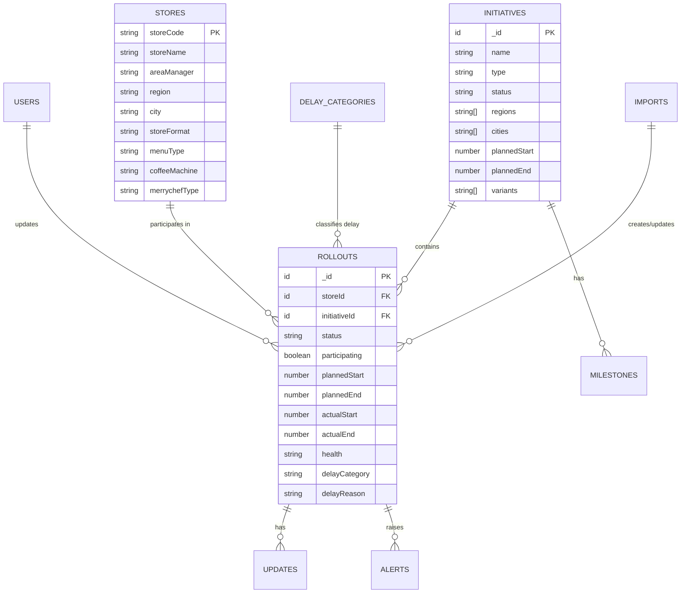

# Data Model — Prism Tracker (Convex schema)

This document defines the normalized Convex schema that replaces both the Excel matrix and the old Firebase "projects/tasks/snags" model.

## 1. Entity overview



> Convex generates `_id` and `_creationTime` for every document. Foreign keys are stored as `v.id("table")`.

---

## 2. Tables (`convex/schema.ts`)

### `users`
| Field | Type | Notes |
|---|---|---|
| `name` | `string` | Display name |
| `email` | `string` | Login identity (Convex Auth) |
| `role` | `"admin" \| "editor" \| "viewer"` | RBAC |
| `region` | `string?` | Optional scoping for Area Managers |
| `color` | `string?` | Avatar accent (Prism blue family) |

### `stores`  — master data, one row per outlet
| Field | Type | Source column |
|---|---|---|
| `storeCode` | `string` | **Store Code** (e.g. `S017`) — natural key, unique |
| `storeName` | `string` | **Store Name** |
| `areaManager` | `string` | **Area Manager Name** |
| `region` | `string` | **Region** (South-1, South-2, North, West…) |
| `city` | `string` | **City** |
| `storeFormat` | `"Highstreet" \| "Mall" \| "Corporate" \| "SIS" \| "Other"` | **Store Format** |
| `menuType` | `"Dine-In" \| "Grab & Go" \| "Other"` | **Menu Type** |
| `coffeeMachine` | `string` | **Coffee machines Name** (La Marzocco, Eversys, Sanremo…) |
| `merrychefType` | `string` | **Type of Merrychef** (E1S, E2S, E1S & E2S, Not Applicable) |
| `active` | `boolean` | Soft-delete flag |

**Indexes:** `by_storeCode (storeCode)`, `by_region (region)`, `by_areaManager (areaManager)`.

### `initiatives` — one per trial/launch/pilot/transition (a spreadsheet column)
| Field | Type | Notes |
|---|---|---|
| `name` | `string` | e.g. *Napoli Margherita Pizza (8.5 inch Frozen)* |
| `type` | `"trial" \| "launch" \| "pilot" \| "transition"` | Derived from header wording |
| `status` | `"planned" \| "active" \| "completed" \| "paused" \| "cancelled"` | Lifecycle |
| `productCategory` | `string?` | e.g. Beverage, Food, Milk, Pizza, Pasta |
| `variants` | `string[]` | e.g. `["Aglio Olio","Alfredo","Creamy Tomato"]` |
| `regions` | `string[]` | Scope, e.g. `["BLR","Delhi/NCR"]` for Vanilla Frappe (Nutaste) |
| `cities` | `string[]` | Optional finer scope |
| `vendor` | `string?` | e.g. Nutaste, Olam |
| `plannedStart` | `number` (ms) | Parsed trial/launch start date |
| `plannedEnd` | `number?` (ms) | Parsed trial/launch end date |
| `ownerEmail` | `string?` | Launch/Category Manager |
| `notes` | `string?` | Free text (e.g. milk container spec) |

**Indexes:** `by_status (status)`, `by_type (type)`.

### `rollouts` — the heart of the model: one store × one initiative
| Field | Type | Notes |
|---|---|---|
| `storeId` | `id("stores")` | FK |
| `initiativeId` | `id("initiatives")` | FK |
| `participating` | `boolean` | `true` where the matrix cell = "Yes" |
| `status` | `"not_started" \| "in_progress" \| "live" \| "completed" \| "delayed" \| "dropped"` | |
| `plannedStart` | `number?` | Defaults from initiative; can override per store |
| `plannedEnd` | `number?` | |
| `actualStart` | `number?` | When the store actually went live |
| `actualEnd` | `number?` | |
| `health` | `"green" \| "amber" \| "red"` | Computed (see [FEATURES.md](FEATURES.md#health-scoring)) |
| `isDelayed` | `boolean` | Set by delay engine |
| `delayCategory` | `string?` | FK-ish to `delayCategories.key` |
| `delayReason` | `string?` | "delayed due to…" free text |
| `delayDays` | `number?` | Computed slip in days |
| `assignedTo` | `string?` | Usually the store's Area Manager |
| `lastUpdatedBy` | `string?` | Audit |

**Indexes:**
`by_store (storeId)`, `by_initiative (initiativeId)`,
`by_store_initiative (storeId, initiativeId)` ← uniqueness key for idempotent import,
`by_status (status)`, `by_health (health)`, `by_delayed (isDelayed)`.

### `milestones` — key dates inside an initiative
| Field | Type | Notes |
|---|---|---|
| `initiativeId` | `id("initiatives")` | FK |
| `title` | `string` | e.g. "Equipment install", "Staff training", "Go-live" |
| `dueDate` | `number` | |
| `status` | `"pending" \| "done" \| "missed"` | |
| `scope` | `"all_stores" \| "store"` | |
| `storeId` | `id("stores")?` | Set when milestone is store-specific |

**Index:** `by_initiative (initiativeId)`.

### `delayCategories` — controlled vocabulary for delay reasons
| Field | Type | Notes |
|---|---|---|
| `key` | `string` | e.g. `equipment`, `supply`, `staffing` |
| `label` | `string` | e.g. "Equipment not installed" |
| `color` | `string` | Chart color |
Seed list in [FEATURES.md](FEATURES.md#delay-categories).

### `updates` — notes / status history on a rollout (replaces comments)
| Field | Type | Notes |
|---|---|---|
| `rolloutId` | `id("rollouts")` | FK |
| `text` | `string` | |
| `kind` | `"note" \| "status_change" \| "delay" \| "system"` | |
| `authorEmail` | `string` | |
| `meta` | `any?` | e.g. `{ from: "not_started", to: "live" }` |

**Index:** `by_rollout (rolloutId)`.

### `alerts` — notifications
| Field | Type | Notes |
|---|---|---|
| `type` | `"slip" \| "milestone_due" \| "blocker" \| "digest"` | |
| `severity` | `"info" \| "warning" \| "critical"` | |
| `message` | `string` | |
| `rolloutId` | `id("rollouts")?` | |
| `initiativeId` | `id("initiatives")?` | |
| `forEmail` | `string?` | Targeted recipient (e.g. Area Manager) |
| `read` | `boolean` | |

**Indexes:** `by_recipient (forEmail, read)`, `by_creation`.

### `imports` — audit of each spreadsheet ingest
| Field | Type | Notes |
|---|---|---|
| `fileName` | `string` | |
| `importedBy` | `string` | |
| `rowsParsed` | `number` | |
| `storesUpserted` | `number` | |
| `initiativesUpserted` | `number` | |
| `rolloutsUpserted` | `number` | |
| `warnings` | `string[]` | Unmapped headers, bad dates, etc. |
| `status` | `"preview" \| "committed" \| "failed"` | |

---

## 3. Schema sketch (TypeScript)

```ts
// convex/schema.ts
import { defineSchema, defineTable } from "convex/server";
import { v } from "convex/values";

export default defineSchema({
  users: defineTable({
    name: v.string(),
    email: v.string(),
    role: v.union(v.literal("admin"), v.literal("editor"), v.literal("viewer")),
    region: v.optional(v.string()),
    color: v.optional(v.string()),
  }).index("by_email", ["email"]),

  stores: defineTable({
    storeCode: v.string(),
    storeName: v.string(),
    areaManager: v.string(),
    region: v.string(),
    city: v.string(),
    storeFormat: v.string(),
    menuType: v.string(),
    coffeeMachine: v.string(),
    merrychefType: v.string(),
    active: v.boolean(),
  })
    .index("by_storeCode", ["storeCode"])
    .index("by_region", ["region"])
    .index("by_areaManager", ["areaManager"]),

  initiatives: defineTable({
    name: v.string(),
    type: v.union(
      v.literal("trial"), v.literal("launch"),
      v.literal("pilot"), v.literal("transition"),
    ),
    status: v.union(
      v.literal("planned"), v.literal("active"),
      v.literal("completed"), v.literal("paused"), v.literal("cancelled"),
    ),
    productCategory: v.optional(v.string()),
    variants: v.array(v.string()),
    regions: v.array(v.string()),
    cities: v.array(v.string()),
    vendor: v.optional(v.string()),
    plannedStart: v.number(),
    plannedEnd: v.optional(v.number()),
    ownerEmail: v.optional(v.string()),
    notes: v.optional(v.string()),
  })
    .index("by_status", ["status"])
    .index("by_type", ["type"]),

  rollouts: defineTable({
    storeId: v.id("stores"),
    initiativeId: v.id("initiatives"),
    participating: v.boolean(),
    status: v.union(
      v.literal("not_started"), v.literal("in_progress"),
      v.literal("live"), v.literal("completed"),
      v.literal("delayed"), v.literal("dropped"),
    ),
    plannedStart: v.optional(v.number()),
    plannedEnd: v.optional(v.number()),
    actualStart: v.optional(v.number()),
    actualEnd: v.optional(v.number()),
    health: v.union(v.literal("green"), v.literal("amber"), v.literal("red")),
    isDelayed: v.boolean(),
    delayCategory: v.optional(v.string()),
    delayReason: v.optional(v.string()),
    delayDays: v.optional(v.number()),
    assignedTo: v.optional(v.string()),
    lastUpdatedBy: v.optional(v.string()),
  })
    .index("by_store", ["storeId"])
    .index("by_initiative", ["initiativeId"])
    .index("by_store_initiative", ["storeId", "initiativeId"])
    .index("by_status", ["status"])
    .index("by_health", ["health"])
    .index("by_delayed", ["isDelayed"]),

  milestones: defineTable({
    initiativeId: v.id("initiatives"),
    title: v.string(),
    dueDate: v.number(),
    status: v.union(v.literal("pending"), v.literal("done"), v.literal("missed")),
    scope: v.union(v.literal("all_stores"), v.literal("store")),
    storeId: v.optional(v.id("stores")),
  }).index("by_initiative", ["initiativeId"]),

  delayCategories: defineTable({
    key: v.string(),
    label: v.string(),
    color: v.string(),
  }).index("by_key", ["key"]),

  updates: defineTable({
    rolloutId: v.id("rollouts"),
    text: v.string(),
    kind: v.union(
      v.literal("note"), v.literal("status_change"),
      v.literal("delay"), v.literal("system"),
    ),
    authorEmail: v.string(),
    meta: v.optional(v.any()),
  }).index("by_rollout", ["rolloutId"]),

  alerts: defineTable({
    type: v.union(
      v.literal("slip"), v.literal("milestone_due"),
      v.literal("blocker"), v.literal("digest"),
    ),
    severity: v.union(v.literal("info"), v.literal("warning"), v.literal("critical")),
    message: v.string(),
    rolloutId: v.optional(v.id("rollouts")),
    initiativeId: v.optional(v.id("initiatives")),
    forEmail: v.optional(v.string()),
    read: v.boolean(),
  }).index("by_recipient", ["forEmail", "read"]),

  imports: defineTable({
    fileName: v.string(),
    importedBy: v.string(),
    rowsParsed: v.number(),
    storesUpserted: v.number(),
    initiativesUpserted: v.number(),
    rolloutsUpserted: v.number(),
    warnings: v.array(v.string()),
    status: v.union(v.literal("preview"), v.literal("committed"), v.literal("failed")),
  }),
});
```

---

## 4. Key design decisions

- **Flat tables, not subcollections.** Firestore nested `projects/{id}/tasks`. Convex uses flat tables with indexed FKs — simpler roll-up queries across all stores/initiatives.
- **`rollouts` is the join table.** The Excel matrix cell becomes a first-class record carrying status, dates, health, and delay info. This is what makes *"delayed due to…"* possible per store per initiative.
- **`storeCode` + `initiative name` is the idempotency key** for import (`by_store_initiative` index) — re-importing updates instead of duplicating.
- **Dates stored as epoch ms** (`number`) for easy comparison in the delay engine; the importer parses the messy human date strings (e.g. `9th October'25`, `25-05-2026`).
- **Enums via `v.union(v.literal(...))`** enforce the same boundaries the old `security_spec.md` required for status/priority.
