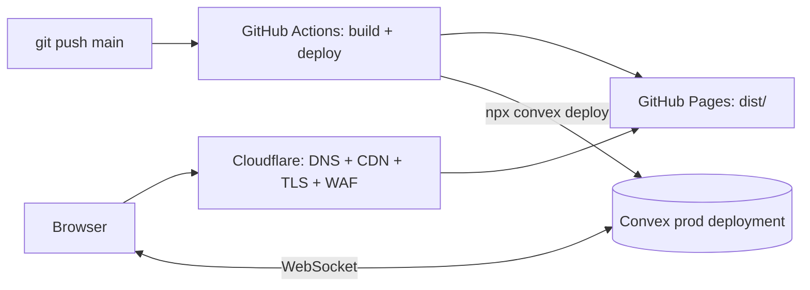

# Deployment — Prism Tracker

Prism Tracker ships as a **static SPA on GitHub Pages**, fronted by **Cloudflare**, with **Convex** as the managed backend. This doc covers build config, CI, DNS, and environments.



---

## 1. Convex backend

### Setup
```bash
npm install convex
npx convex dev          # first run: login + create dev deployment
```
This generates `convex/` functions and a dev deployment URL.

### Environment variables (Convex dashboard → Settings → Environment)
| Var | Purpose |
|---|---|
| `AI_API_KEY` | Key for AI summaries (used only in `convex/ai.ts` actions) |
| `EMAIL_API_KEY` | Optional: Resend/SES for email alerts |
| `AUTH_*` | Convex Auth provider config (password / magic-link) |

### Deploy to production
```bash
npx convex deploy        # promotes functions + schema to prod deployment
```
Production exposes a stable URL consumed by the frontend as `VITE_CONVEX_URL`.

---

## 2. Frontend build (Vite → GitHub Pages)

### `vite.config.ts` change
GitHub Pages **project sites** are served from `https://<user>.github.io/<repo>/`, so set `base`:

```ts
export default defineConfig(() => ({
  base: process.env.GITHUB_PAGES === 'true' ? '/<repo-name>/' : '/',
  plugins: [react(), tailwindcss()],
  // ...existing config...
}));
```
> If you attach a **custom domain via Cloudflare** (recommended), use `base: '/'` and a `CNAME` file instead — simpler routing.

### SPA fallback for deep links
GitHub Pages has no server rewrite. Add a `public/404.html` that redirects to `index.html` (standard SPA-on-Pages trick), or use hash-based routing.

### Frontend env
| Var | Purpose |
|---|---|
| `VITE_CONVEX_URL` | Convex production URL (injected at build) |

---

## 3. GitHub Actions CI/CD

`.github/workflows/deploy.yml` (outline):

```yaml
name: Deploy
on:
  push:
    branches: [main]
permissions:
  contents: read
  pages: write
  id-token: write
jobs:
  build-deploy:
    runs-on: ubuntu-latest
    steps:
      - uses: actions/checkout@v4
      - uses: actions/setup-node@v4
        with: { node-version: 20, cache: npm }
      - run: npm ci

      # Deploy Convex backend (schema + functions)
      - run: npx convex deploy
        env:
          CONVEX_DEPLOY_KEY: ${{ secrets.CONVEX_DEPLOY_KEY }}

      # Build static frontend pointed at prod Convex
      - run: npm run build
        env:
          GITHUB_PAGES: 'true'
          VITE_CONVEX_URL: ${{ secrets.VITE_CONVEX_URL }}

      - uses: actions/upload-pages-artifact@v3
        with: { path: dist }
      - uses: actions/deploy-pages@v4
```

### Required GitHub secrets
| Secret | From |
|---|---|
| `CONVEX_DEPLOY_KEY` | Convex dashboard → Deploy key |
| `VITE_CONVEX_URL` | Convex prod deployment URL |

Enable **Settings → Pages → Build and deployment → GitHub Actions**.

---

## 4. Cloudflare (DNS + CDN + security)

Put Cloudflare in front of GitHub Pages for a custom domain, caching, TLS, and protection.

### DNS
1. Add the domain/subdomain (e.g. `tracker.prism.example.com`) to Cloudflare.
2. Create a `CNAME` record → `<user>.github.io` (proxied, orange cloud ON).
3. In the repo, add a `public/CNAME` file containing the custom domain so Pages serves it.
4. In **Settings → Pages → Custom domain**, set the same domain; wait for the GitHub cert/verification.

### TLS / SSL
- Cloudflare SSL/TLS mode: **Full** (GitHub Pages provides HTTPS at origin).
- Enable **Always Use HTTPS** and **Automatic HTTPS Rewrites**.

### Caching
- Static assets (`/assets/*`, hashed) → cache aggressively (Cloudflare default + a Cache Rule for long TTL on hashed files).
- `index.html` / `404.html` → **bypass or short TTL** so new deploys appear immediately.

### Security
- **WAF / rate limiting** on the zone.
- Optional **Cloudflare Access** to gate the whole app behind email-based login (extra layer on top of Convex Auth) — good for an internal-only tool.
- `Connect-src` must allow the Convex WebSocket origin (CSP, if you add one).

---

## 5. Environments summary

| Concern | Dev | Production |
|---|---|---|
| Backend | `npx convex dev` (per-dev deployment) | Convex prod (`convex deploy`) |
| Frontend | `npm run dev` @ localhost:3000 | GitHub Pages build |
| Convex URL | dev URL in `.env.local` | `VITE_CONVEX_URL` secret |
| Domain | localhost | Cloudflare custom domain → Pages |
| Auth | Convex Auth (dev) | Convex Auth (prod) |

`.env.local` (dev, git-ignored):
```
VITE_CONVEX_URL=https://<your-dev>.convex.cloud
```

---

## 6. Decommissioning Firebase

After the Convex cutover (see [ROADMAP.md](ROADMAP.md)):
- Remove `firebase` dependency, `src/firebase.ts`, `firebase-applet-config.json`, `firebase-blueprint.json`, `firestore.rules`.
- Delete the Firebase project once data is migrated/verified.
- Update `package.json` scripts and remove `express`/`server.js` artifacts if unused (the app is fully static + Convex).

---

## 7. Release checklist

- [ ] Convex schema deployed; indexes present.
- [ ] Spreadsheet imported & verified in prod (counts match).
- [ ] `VITE_CONVEX_URL` + `CONVEX_DEPLOY_KEY` secrets set.
- [ ] GitHub Pages enabled via Actions; build green.
- [ ] Cloudflare DNS proxied; HTTPS forced; `index.html` not over-cached.
- [ ] Auth works on the custom domain.
- [ ] Delay cron + alerts verified running.
- [ ] Firebase removed.
