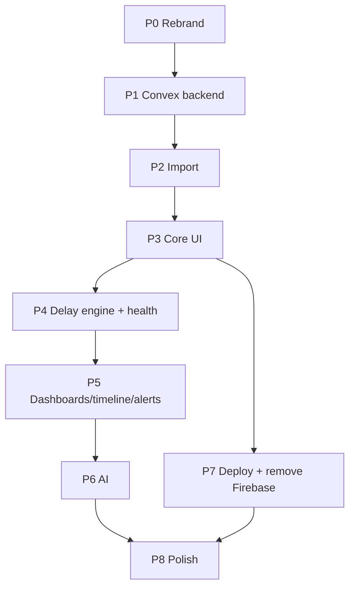

# Roadmap — Prism Tracker

Phased plan to take the existing Firebase "Lightweight Project Tracker" to a fully automated, Convex-backed **Prism Tracker** deployed on GitHub Pages + Cloudflare.

Legend: 🔴 Must · 🟡 Should · 🟢 Could

---

## Phase 0 — Foundation & rebrand
**Goal:** Repo connected, app rebranded to Prism Tracker, blue accent applied (still on Firebase, so nothing breaks).

- 🔴 Connect GitHub repo, set up branches.
- 🔴 Rebrand: name, wordmark `PRISM TRACKER`, tagline, login portal copy.
- 🔴 Swap indigo → blue accent across [App.tsx](../src/App.tsx) and [Dashboard.tsx](../src/components/Dashboard.tsx) per [DESIGN_SYSTEM.md](DESIGN_SYSTEM.md).
- 🔴 Update [metadata.json](../metadata.json) name/description.
- 🟡 Add `docs/` (this set) to the repo.

**Exit:** App looks like Prism Tracker; no functional change.

---

## Phase 1 — Convex backend stand-up
**Goal:** Convex project live with the new schema; auth working.

- 🔴 `npm install convex`, `npx convex dev`.
- 🔴 Implement `convex/schema.ts` per [DATA_MODEL.md](DATA_MODEL.md).
- 🔴 Configure Convex Auth (email/password or magic-link) — no Google dependency.
- 🔴 Add `ConvexProvider` + `src/convex.ts`; wire `VITE_CONVEX_URL`.
- 🔴 Seed `delayCategories`.
- 🟡 Basic role model on `users` (admin/editor/viewer).

**Exit:** Can sign in via Convex; empty schema queryable.

---

## Phase 2 — Spreadsheet import pipeline
**Goal:** The Excel/CSV becomes live data.

- 🔴 Client-side parser (SheetJS) handling the 3-row matrix header per [DATA_IMPORT.md](DATA_IMPORT.md).
- 🔴 Date parser for messy formats (`9th October'25`, `25-05-2026`, …).
- 🔴 Import preview UI (stores / initiatives / rollouts / warnings).
- 🔴 `imports.commit` action + idempotent upsert mutations (keyed on storeCode, initiative name, store+initiative).
- 🔴 Import the real file; verify counts.
- 🟡 Re-import diff summary.

**Exit:** All stores, the 7 initiatives, and "Yes" rollouts exist in Convex.

---

## Phase 3 — Core tracking UI (Convex-powered)
**Goal:** Replace Firebase data layer; manage rollouts live.

- 🔴 Rewrite `ProjectContext` → Convex `useQuery`/`useMutation` data layer.
- 🔴 Initiatives list + detail.
- 🔴 Rollout board / matrix (store × initiative) with status colors.
- 🔴 Rollout detail (status, dates, notes, history) — evolve [TaskDetailModal.tsx](../src/components/TaskDetailModal.tsx).
- 🔴 Store view.
- 🟡 Global filter bar (region / AM / initiative / status / health).

**Exit:** Users can view and update rollouts; Firebase no longer read for core data.

---

## Phase 4 — Delay engine & health 🔴 (headline)
**Goal:** "Delayed due to…" automation.

- 🔴 `crons.ts → detectDelays` nightly sweep.
- 🔴 Delay capture flow (category + reason required on `delayed`).
- 🔴 Health scoring (`green/amber/red`) per rollout + roll-ups (initiative/region/portfolio).
- 🔴 Delays view grouped by category with chart.
- 🟡 Health trend snapshots.

**Exit:** Overdue rollouts auto-flag, demand a reason, and roll up into dashboards.

---

## Phase 5 — Dashboards, timeline, alerts
**Goal:** Leadership-grade visibility.

- 🔴 Portfolio dashboard (status/health counts, delayed list, by region/initiative) — evolve [Dashboard.tsx](../src/components/Dashboard.tsx).
- 🟡 Gantt/timeline with milestones.
- 🟡 In-app alerts inbox (reactive `alerts`).
- 🟡 Email alerts via Convex action (Resend/SES).

**Exit:** One screen answers "where are we / what's slipping."

---

## Phase 6 — AI insights
**Goal:** Auto-written status & risk.

- 🟡 `convex/ai.ts` action (server-side key) for weekly portfolio summary.
- 🟡 Per-initiative risk brief.
- 🟢 Delay-theme clustering across reasons.
- 🟢 Natural-language ask.

**Exit:** Weekly narrative generated on demand; clearly labeled AI.

---

## Phase 7 — Deploy & decommission Firebase
**Goal:** Production on Pages + Cloudflare; Firebase gone.

- 🔴 `base`/`404.html`/`CNAME` for Pages per [DEPLOYMENT.md](DEPLOYMENT.md).
- 🔴 GitHub Actions: `convex deploy` + Pages deploy.
- 🔴 Cloudflare DNS/CDN/TLS in front; cache rules.
- 🔴 Remove `firebase`, `src/firebase.ts`, config/rules/blueprint files.
- 🟡 Optional Cloudflare Access gating.

**Exit:** Live at the custom domain; Firebase removed; release checklist passed.

---

## Phase 8 — Polish & hardening 🟢
- 🟢 CSV/Excel export (round-trip).
- 🟢 Region-scoped editor permissions.
- 🟢 Audit log UI.
- 🟢 Saved filter views / shareable links.
- 🟢 Accessibility & performance pass (10k rollouts).

---

## Dependency order

---

## Risks & mitigations

| Risk | Mitigation |
|---|---|
| Messy spreadsheet headers/dates break import | Robust parser + preview + warnings; manual confirm before commit |
| Re-import overwrites manual edits | Idempotent upsert only touches `participating`; protects status/delay fields |
| Convex limits on big mutations | Chunk import batches in the action |
| AI hallucination in summaries | Advisory-only, labeled, never auto-writes data |
| Pages deep-link 404s | `404.html` SPA fallback or hash routing |
| Cloudflare over-caching `index.html` | Short TTL / bypass rule for HTML |
